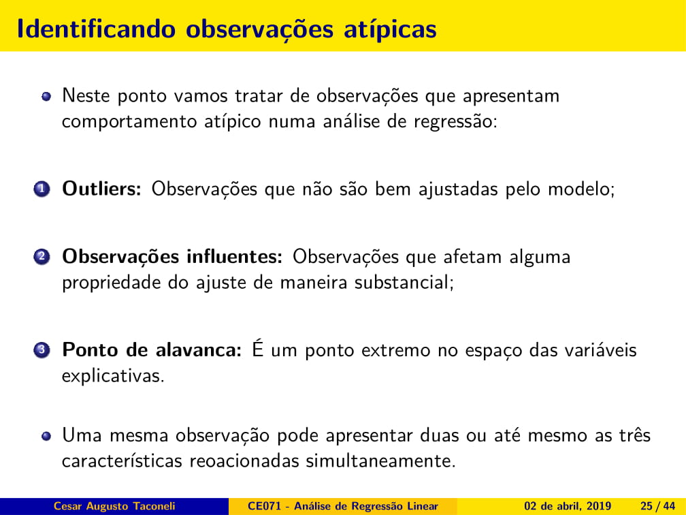

```{r setup, echo=FALSE}
library(knitr)
opts_chunk$set(cache=TRUE, autodep = TRUE)
dep_auto()
```

# Matriz dos Scatterplots

```{r warning = F, message = F}
require(magrittr)
require(faraway)
require(car)
data("teengamb")
pairs(teengamb, cex = 2, pch = 20)

```

# Modelo e ANOVA

```{r}
ajuste <- lm(gamble ~ ., data = teengamb)
summary(ajuste)
```

# Diagnóstico do ajuste

{width=49%} {width=49%}

# Tipos de resíduos: (5)

{width=49%}
{width=49%}

## 1. Resíduos ordinários

```{r}
resid(ajuste) %>% head(., n = 5)
```

## 2. Resíduos padronizados

{width=49%}  


```{r}
QMRes <- summary(ajuste)$sigma^2 
(resid(ajuste)/sqrt(QMRes)) %>% head(., n = 5)
```

## 3. Resíduos studentizados

{width=49%}

```{r}
rstandard(ajuste) %>% head(., n = 5)
```

## 4. Resíduos studentizados externamente

{width=49%}


```{r}
rstudent(ajuste) %>% head(., n = 5)
```

## 5. Resíduos PRESS

```{r}
rstandard(ajuste, type="pred") %>% head(., n = 5)
```

# Análise de Resíduos

{width=49%}
{width=49%}

## Gráfico de Resíduos vs Valores Ajustados

```{r}
fit <- fitted(ajuste)
res <- rstudent(ajuste)
par(cex = 1.4, las = 1)
plot(fit, res, xlab = 'Valores ajustados', ylab = 'Resíduos studentizados', pch = 20)
```

Fica bastante evidente que os resíduos não apresentam variância constante.

## Testes de Hipótese

{width=49%} {width=49%}

## Teste de variância constante

$$H_0: \text{Resíduos têm variância constante}$$

```{r}
ncvTest(ajuste)
```

Temos evidência altamente significativa de variância não constante.

## Teste de normalidade para os resíduos (Shapiro-Wilk)

$$H_0: \text{Os resíduos seguem distribuição normal }$$
```{r}
shapiro.test(rstudent(ajuste))
```

A hipótese de normalidade é rejeitada.

## Gráfico quantil-quantil com envelope de confiança

```{r}
qqPlot(ajuste, pch = 20, cex = 1.5, xlab = 'Quantis t-Student', ylab = 'Resíduos studentizados')
```

Os resíduos não apresentam boa aderência à distribuição t-Student de referência.

## Resíduos vs variáveis incluídas no modelo

```{r}
par(mfrow=c(2,2))
plot(teengamb$sex, res, xlab = 'Sexo', ylab = 'Resíduos studentizados', pch = 20)
plot(teengamb$status, res, xlab = 'Status', ylab = 'Resíduos studentizados', pch = 20)
plot(teengamb$income, res, xlab = 'Income', ylab = 'Resíduos studentizados', pch = 20)
plot(teengamb$verbal, res, xlab = 'Verbal', ylab = 'Resíduos studentizados', pch = 20)
lines(lowess(res ~ teengamb$verbal), lwd = 2, col = 'red')
```

A variância dos resíduos não aparenta ser constante em relação às variáveis `sexo` e `income`.

## Gráficos de resíduos parciais

```{r}
par(mfrow=c(2,2))
termplot(ajuste, partial.resid = TRUE, terms = 1, pch = 20, col.res = 'black')
termplot(ajuste, partial.resid = TRUE, terms = 2, pch = 20, col.res = 'black')
termplot(ajuste, partial.resid = TRUE, terms = 3, pch = 20, col.res = 'black')
termplot(ajuste, partial.resid = TRUE, terms = 4, pch = 20, col.res = 'black')
```

Os gráficos de resíduos parciais evidenciam a relação entre sexo e income (linear?) com a resposta (ajustado pelo efeito das demais variáveis).

## Gráficos de diagnóstico (padrão do R)

```{r}
par(mfrow = c(2,2))
plot(ajuste, which = 1:4)
```

## Usando recursos de diagnóstico do pacote car

## Gráficos de Resíduos Parciais

```{r}
crPlots(ajuste, cex = 2, pch = 20) 
```

## Gráfico de Resíduos vs Variáveis no modelo

```{r}
residualPlots(ajuste, cex = 2, pch = 20) 
```

## Gráfico de resíduos marginais (resíduos versus variável não ajustada

```{r}
marginalModelPlots(ajuste) 
```

## Diagnóstico de outliers, pontos de alavanca e influência

{width=49%}
{width=49%}
{width=49%}
{width=49%}
{width=49%}
{width=49%}
{width=49%}
{width=49%}
{width=49%}
{width=49%}
{width=49%}
{width=49%}
{width=49%}
{width=49%}


```{r warning = FALSE, fig.height = 9, fig.width = 11}
influenceIndexPlot(ajuste, id.n = 3, cex.lab = 1.4, cex = 1.4, las = 1, pch = 20)
```

# Análise de pontos atípicos

Vamos relevar, por um instante, as demais inadequações do ajuste e nos concentrar no efeito da observação **24**, indicada como outlier e observação influente.

```{r}
teengamb[24,]
summary(teengamb)
```

Trata-se do adolesente com maior valor gasto em apostas. Vamos reajustar o modelo desconsiderando este indivíduo.

### Utilizar o modelo ajuste e retirar a observação **24**

```{r}
ajuste_v2 <- update(ajuste, subset = -24)
```

### Comparar estimativas e erros padrões produzidas pelos dois modelos

```{r}
compareCoefs(ajuste, ajuste_v2)
```

Nota-se redução expressiva na estimativa referente ao efeito de sexo. Os erros padrões de sexo e income são reduzidos ao desconsiderar o dado sob investigação. De qualquer forma, as conclusões se mantêm com relação aos efeitos significativos e não significativos na análise.

### Conferir se a variância está constante

```{r}
par(mfrow = c(2,2))
plot(ajuste_v2, which = 1:4)
par(mfrow = c(1,1))
qqPlot(ajuste_v2)
```

Mesmo após a exclusão dos dados do indivíduo **24** os resíduos ainda apresentam variância não constante. Ainda há um resíduo com valor absoluto próximo a 3 que mereceria alguma atenção.

### Gráfico para os dfbetas

{width=49%}

```{r}
dfbetaPlots(ajuste, id.n = 3, cex.lab = 1.4, las = 1, pch = 20)
```

Novamente a observação **24** aparece como potencial ponto influente na estimativa de cada parâmetro do modelo.

```{r}
i_med <- influence.measures(ajuste)
summary(i_med)
```

# Análise de multicolinearidade

{width=49%}
{width=49%}

{width=49%}
{width=49%}

{width=49%}

```{r warning = F}
require(faraway)
require(corrplot)
require(car)
```

Nosso objetivo aqui é ajustar um modelo de regressão linear considerando a variável `hipcenter` como resposta e as demais variáveis como explicativas.

Como diagnóstico preliminar de multicolinearidade vamos analisar as correlações bivariadas.

```{r}
mat_cor <- cor(seatpos)
round(mat_cor, 2)
corrplot.mixed(mat_cor, upper = 'ellipse', number.cex = 1.2)
```

É possível observar correlações lineares bastante fortes entre as covariáveis, algumas delas maiores que 0,90. Fortíssimo indicador de multicolinearidade.

```{r}
modelo <- lm(hipcenter ~ . , data = seatpos)
summary(modelo)
```

Embora as correlações bivariadas entre a resposta e as explicativas sejam numericamente bastante elevadas, o modelo ajustado não indica significância para nenhuma variável explicativa. Esse resultado é contraditório, ainda, com o valor do $R^2$ (0.687), que é bastante expressivo e pouco compatível com um modelo sem qualquer variável associada à resposta.

### Valores de VIF

Na mão:

```{r}
ajuste_Leg <- lm(Leg ~ Age + Weight + HtShoes + Ht + Seated + Arm + Thigh, data = seatpos)
R2 <- summary(ajuste_Leg)$r.squared
vif_Leg <- (1/(1-R2)) 
```

```{r}
vif(modelo)
```

Há muita colinearidade nos dados. Se extrairmos a raiz quadrada de qualquer
um desses valores, teremos quantas vezes o respectivo erro padrão é maior
do que aquele que teríamos se as variáveis fossem ortogonais.

```{r}
sqrt(vif(modelo))
```

Para avlaiar o efeito da multicolinearidade, vamos perturbar levemente
a variável resposta, adicionando erros aleatórios com distribuição
`Normal(0 , 5)` a cada valor de y.

## Modelo 2 - Perturbação na variável resposta

```{r}
modelo2 <- lm(hipcenter + rnorm(38, 0, 5) ~ . , data = seatpos)
summary(modelo2)
summary(modelo)
```

Embora o $R^2$ dos dois modelos seja praticamente o mesmo, percebe-se uma
boa variação nas estimativas pontuais geradas pelos dois modelos. Esse
tipo de comportamento frente a pequenas perturbações nos dados é típico
em casos de multicolinearidade.
Com exceção da idade, as demais variáveis explicativas estão, em geral,
fortemente correlacionadas. O que aconteceria se usássemos apenas uma
delas na especificação do modelo? Vamos considerar a altura aferida
com o indivíduo descalço.

## Modelo 3 - regressão linear simples

```{r}
modelo3 <- lm(hipcenter ~ Ht, data = seatpos)
summary(modelo3)
```

A associação entre a altura e a variável resposta é altamente significativa.
Além disso, a variação no coeficiente de determinação, resultante da
eliminação de todas as outras variáveis, foi bem pequena. Algo semelhante
ocorreria se escolhessemos alguma outra variável ao invés de Ht. Fica
como exercício.
Vamos usar a técnica de análise de componentes principais para encontrar
uma (ou poucas) combinações lineares ortogonais das variáveis explicativas
que conservem a maior parte possível da variação dos dados.

```{r}
pca <- princomp(seatpos[,1:8], cor = TRUE)
```

O argumento `cor = T` serve para executar a análise com base nos dados
padronizados. NA ACP, isso é importante devido às diferentes escalas
das variáveis.

```{r}
summary(pca)
```

 O primeiro componente explica 70.9% da variação original dos dados; o
 segundo componente explica 15,4% e, somados, os dois explicam 86,3% da
 variação total.

```{r}
pca$loadings
```

 As cargas (loadings) dos componentes correspondem aos coeficientes 
 das combinações lineares. Assim, o primeiro componente é praticamente
 uma média aritmética de todas as variáveis explicativas, com exceção
 da idade. É um componente referente ao tamanho do motorista, de forma geral.
 No segundo componente o coeficiente correspondente à idade
 é muito maior que os demais, de forma que esse componente expressa,
 de forma predominante, a idade dos motoristas.

```{r}
scores <- pca$scores; scores %>% head(., n = 5)
```

Os escores são os valores dos componentes calculados para cada indivíduo.

```{r}
cor(scores) %>% head(., n = 5)
```

Observe que os escores são ortogonais.

Vamos fazer um novo ajuste do modelo de regressão agora substituindo as variáveis originais pelos escores dos dois componentes principais.

### Modelo 4 

```{r}
seatpos_novo <- data.frame(seatpos$hipcenter, scores[,1:2])
ajuste_pca <- lm(seatpos.hipcenter ~ ., data = seatpos_novo)
summary(ajuste_pca)
```

Observe que ambos os componentes estão associados de forma significativa à posição de dirigir. Além disso, o $R^2$ e a significância do modelo ajustado são bastante próximos aos do modelo original.
